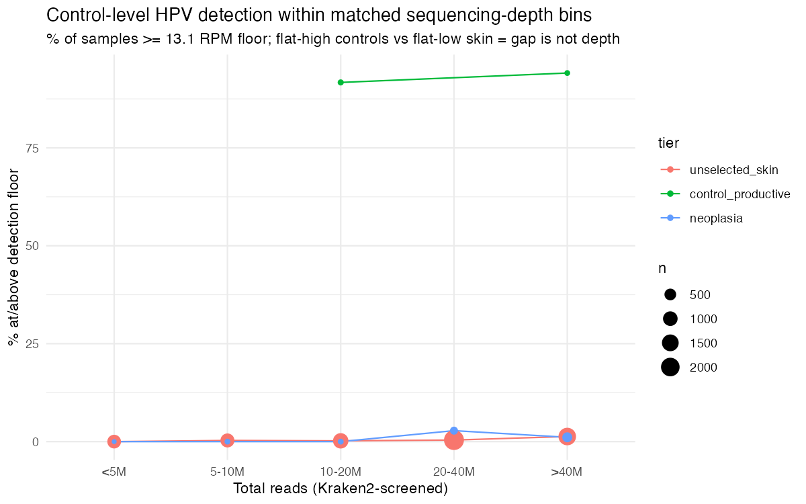

# Supplementary Material {.unnumbered}

::: {#suppfig-depth}


Control-level HPV detection within matched sequencing-depth bins. For each population tier, the percentage of libraries reaching the control-calibrated detection floor (`r p1(stats$floor_rpm)` RPM) is plotted within five total-read bins (<5M, 5–10M, 10–20M, 20–40M, >40M reads). Productive controls (warts/condyloma) detect at 90–100% in every bin in which they occur, whereas cutaneous neoplasia (cSCC/actinic keratosis) and unselected skin stay near zero across all bins, including the deepest. This depth-matched comparison confirms that the tier difference in @fig-rpm is not produced by differences in sequencing depth. Point size is proportional to the number of libraries in each tier × bin.
:::

::: {#supptbl-types}
```{r}
#| echo: false
#| output: asis
cat(knitr::kable(build_type_table(), format = "pipe", align = c("l", rep("r", 6))), sep = "\n")
```

Number of libraries assigned to each HPV reference type across population tiers (types with ≥2 assigned libraries shown). The high-risk mucosal types HPV16 and HPV18 are confined almost entirely to cell-line and engineered material, the signature of integrated-HPV cell-line contamination. Productive controls are dominated by cutaneous wart and low-risk types (HPV57, HPV2, HPV27, HPV6/11, HPV42), unselected skin shows a sparse, low-burden scatter of beta- and gamma-types, and the neoplasia-associated infections are the gamma- and alpha-types HPV12, HPV16, HPV96 and HPV182.
:::

::: {#supptbl-productive}
```{r}
#| echo: false
#| output: asis
cat(knitr::kable(build_prod_table(), format = "pipe", align = c("l", "l", "l", "r", "r", "r")), sep = "\n")
```

Genuine, non-cell-line productive HPV infections detected in primary skin and skin-associated tissue. Each library met the productive criterion (≥3 L1 major-capsid reads) and was flagged as primary tissue rather than cell line or engineered material. Coverage breadth is the maximum across assigned references for that sample. In the two "other-tissue" co-infections (ERR2274877, ERR1971044) the co-infecting gamma-type HPV182 reached 98–99% genome coverage at 243–245× mean depth. These cases show that bona fide productive cutaneous beta- and gamma-HPV infection does occur in primary tissue, but against the population-scale null they are the exception (see main text and @fig-rpm).
:::

::: {#supptbl-bayes}
```{r}
#| echo: false
#| output: asis
cat(knitr::kable(build_bayes_table(stats, bget), format = "pipe", align = c("l", "l", "l", "r")), sep = "\n")
```

Bayesian re-analysis of the principal contrasts under weakly-informative priors. Each frequentist model (M1–M3; Methods, @tbl-positivity, @fig-rpm) was refitted as a Bayesian logistic regression with a Normal(0, 2.5) prior on the log-odds coefficients and a Normal(0, 5) prior on the intercept (`rstanarm`; four chains, all R-hat ≤ 1.003, no divergent transitions). Odds ratios are posterior medians with 95% credible intervals; P(OR > 1) is the posterior probability of a positive effect. Frequentist odds ratios (with *P* values) are shown for comparison; the productive-controls-versus-skin row is a Fisher exact estimate inflated by near-complete separation, whose Bayesian counterpart is regularised by the prior (a heavier-tailed Student-*t*(3) prior gives an even larger posterior OR, `r bor(bget("M2c_controls_vs_skin_floor_studentt"))`, confirming robustness). Sequencing depth is modelled per 10-fold (log₁₀) change in library size.
:::
