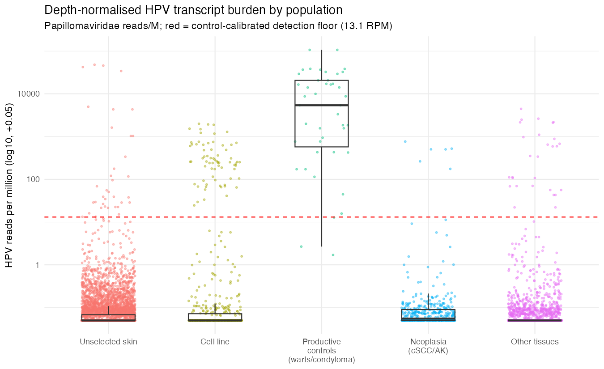

# Cutaneous HPV is transcriptionally quiet in skin and carcinoma but productive in warts: a depth-controlled re-mining of public RNA-seq

*Draft manuscript. Author list and affiliations to be added. Table 1 and Figure 1 to be inserted as final display items; [N] = HPV reference-panel size, to be filled from the built panel.*

## Abstract

Most human papillomaviruses (HPVs) are cutaneous beta- and gamma-types that reside on skin as a largely commensal, subclinical reservoir, yet their role in cutaneous squamous cell carcinoma (cSCC) remains contested between a "hit-and-run" oncogenic model and a protective-immunity model. These viruses are poorly characterised in part because standard transcriptomic pipelines discard the non-human reads that carry HPV signal. We systematically re-mined public human RNA-seq across skin and related tissues with a uniform pipeline that screens every library for papillomavirus reads, types the positives against the full reference panel, and classifies infections as productive from late (L1 major-capsid) transcript expression. To separate genuine infection from the two dominant confounders, we annotated and partitioned cell-line and engineered material and scored every library as papillomavirus reads-per-million, which neutralises sequencing depth. HPV signal in archived data was concentrated in non-primary material: cell-line and engineered libraries were about 7-fold enriched for positivity (OR 7.0, P = 1.5×10⁻¹¹) and dominated by integrated HPV16/HPV18, whereas primary skin carried HPV at only 2–4%. Productive infection was abundant in warts and epidermodysplasia verruciformis (64% of libraries). After depth adjustment, however, HPV in cSCC and actinic keratosis was indistinguishable from unselected skin at productive level (OR 0.75, P = 0.55) despite this being the most deeply sequenced tissue, and persisted only as a trace footprint (any-read OR 1.64, P = 4×10⁻⁵). A minority of genuine lesions nonetheless harboured bona fide productive gamma- and alpha-HPV infection (HPV12, HPV96, HPV182, HPV16). Cutaneous HPV is therefore productive in warts and epidermodysplasia verruciformis but transcriptionally quiet in healthy skin and in carcinoma, where it is a trace, non-productive footprint. This is the phenomenology that both the hit-and-run and the protective-immunity models must accommodate. Beyond HPV, the contamination-aware, depth-normalised framework offers a scalable way to mine the discarded fraction of public transcriptomes.

**Keywords:** human papillomavirus; beta-papillomavirus; cutaneous squamous cell carcinoma; skin virome; productive infection; hit-and-run; RNA-seq; public data re-mining; contamination

## Introduction

Human papillomaviruses (HPVs) are a large and ancient family of small, non-enveloped double-stranded DNA viruses that establish infection in stratified squamous epithelia. More than 220 HPV types have now been fully sequenced and formally classified, partitioned by L1 open-reading-frame identity into five genera: *Alpha-*, *Beta-*, *Gamma-*, *Mu-* and *Nupapillomavirus* (de Villiers et al., 2004; Bzhalava et al., 2015). This genus structure tracks tissue tropism and disease association: the alpha genus contains the mucosal, sexually transmitted types responsible for cervical and other anogenital and oropharyngeal cancers (HPV16, HPV18), whereas the great majority of described types are cutaneous beta- and gamma-HPVs whose natural habitat is the skin (de Villiers et al., 2004; Van Doorslaer et al., 2017). Despite outnumbering the medically prominent alpha types, these cutaneous viruses remain comparatively poorly characterised, and the curated reference genomes that make systematic study possible are consolidated in the Papillomavirus Episteme (PaVE; Van Doorslaer et al., 2017).

Cutaneous beta- and gamma-HPVs behave less like classical pathogens than like members of the commensal skin flora. They are acquired in early life, are ubiquitous on the skin of healthy immunocompetent adults, and persist for months to years as asymptomatic, often low-level infections (Antonsson et al., 2000). Culture-independent surveys of normal-appearing skin reveal striking inter-individual diversity, with multiple co-resident beta- and gamma-genotypes and a continuing discovery of novel types from healthy skin (Foulongne et al., 2012; Nunes et al., 2018). In immunocompetent hosts this carriage is overwhelmingly subclinical: most cutaneous HPV infection lies in a "twilight zone" of latency and immune control rather than producing visible lesions (Doorbar, 2023). Yet the composition and frequency of this reservoir in healthy skin remain a basic, incompletely answered descriptive question: which types are actually present, and how often?

A minority of cutaneous infections do become overtly productive and lesional, and two settings define this productive extreme. Common, plantar and flat warts are highly productive infections, driven principally by alpha types HPV2, HPV27 and HPV57, the mu type HPV1, and gamma types such as HPV4, in which abundant virion assembly in the differentiating epidermis produces the koilocytes that are the histological signature of active viral replication (Egawa & Doorbar, 2017). Epidermodysplasia verruciformis (EV), or Lewandowsky–Lutz dysplasia, is the second: a rare genodermatosis of selective susceptibility to beta-HPVs that manifests as lifelong flat-wart and pityriasis-versicolor-like lesions, with progression to cutaneous squamous cell carcinoma (cSCC) on sun-exposed skin (Orth, 2006; de Jong et al., 2018a). EV is a Mendelian "experiment of nature": biallelic loss-of-function in the adjacent keratinocyte genes *EVER1*/*EVER2* (*TMC6*/*TMC8*), and subsequently in *CIB1*, abolishes a keratinocyte-intrinsic restriction of beta-HPV and renders these otherwise-quiescent commensals pathogenic (Ramoz et al., 2002; Lazarczyk et al., 2008; de Jong et al., 2018b). Warts and EV thus provide the natural positive controls for high-burden, transcriptionally active cutaneous HPV infection.

Between asymptomatic carriage and frank lesion lies the most consequential and most contested role of beta-HPV: as a cofactor in the development of cSCC, the second most common human cancer. Beta-HPV is detected at high frequency in actinic keratoses (AK) and cSCC, particularly in organ-transplant recipients and other immunosuppressed patients, whose cSCC risk is elevated many-fold (Howley & Pfister, 2015; Rollison et al., 2019). The mechanistic model that reconciles this association with the virus's commensal nature is the "hit-and-run" hypothesis: beta-HPV acts early, cooperating with ultraviolet (UV) radiation to expand a field of damaged keratinocytes, but is dispensable for maintenance of the established tumour. Beta-HPV E6 proteins impair the cellular response to UV damage, abrogating ATR signalling and the repair of UV-induced lesions, and disrupt NOTCH and TGF-β signalling to sustain proliferation, without degrading p53 as high-risk alpha-HPV does (Wallace et al., 2012; Meyers et al., 2017). Direct experimental support comes from transgenic and infection models in which genetic deletion of the viral oncogenes after lesions have formed, or transplantation of secondary tumours, leaves carcinoma growth unaffected and viral genomes undetectable (Viarisio et al., 2018; Dorfer et al., 2021), and from UV-dependent MmuPV1 skin carcinogenesis in mice (Uberoi et al., 2016). Consistent with hit-and-run, viral load and transcription in human tissue are highest in early precursor lesions and decline in established carcinoma (Borgogna et al., 2018). This view is not unchallenged: T-cell immunity to commensal papillomaviruses has been shown to be actively *protective* against skin carcinogenesis, reframing immunosuppression-associated cSCC as a failure of antiviral immunosurveillance rather than direct viral oncogenesis (Strickley et al., 2019). Whether beta-HPV is present in established cutaneous neoplasia as a transcriptionally active driver or merely as a trace, hit-and-run footprint is therefore a question that bears directly on its causal role.

Resolving these questions requires distinguishing productive infection from latent, abortive, or transformed states, and the viral transcriptional programme provides exactly this readout. The papillomavirus life cycle is obligately coupled to keratinocyte differentiation: early genes (*E1*, *E2*, *E5*, *E6*, *E7*) are expressed in basal and proliferating cells, whereas genome amplification and the late capsid genes (*L1*, *L2*) are activated only in the terminally differentiated suprabasal layers, where virions are assembled and shed (Doorbar et al., 2012; Graham, 2017). This temporal order is enforced by differentiation-dependent promoter switching, alternative splicing and a shift from early to late polyadenylation (Johansson & Schwartz, 2013). Detection of late (L1/L2) capsid transcripts is consequently a hallmark of productive infection, and can be read out directly from RNA sequencing (Klymenko et al., 2017; Borgogna et al., 2014). The contrast is sharpest in cancer: when HPV integrates, the late programme, and frequently *E2*, is lost, leaving deregulated *E6*/*E7* as the dominant viral transcripts (Moody & Laimins, 2010). An early-versus-late transcript signature therefore separates the productive warts and EV lesions from the latent carriage of normal skin and from any non-productive footprint in carcinoma.

These questions are, in principle, already answerable from data that exist. Public sequence archives now hold millions of human RNA-seq libraries, and re-mining this resource has repeatedly recovered viral signal that the original studies ignored (Edgar et al., 2022). The obstacle is a near-universal feature of transcriptomic pipelines: reads that do not map to the human genome are discarded at the outset, so any HPV transcripts present are silently filtered away before analysis. Recovering them requires returning to the raw reads and classifying the non-human fraction explicitly, an approach validated by dedicated virus-detection workflows (Yasumizu et al., 2021) and efficient metagenomic classifiers such as Kraken2 (Wood et al., 2019). A small number of studies have shown that cutaneous HPV transcripts can indeed be read from skin RNA-seq, including whole-transcriptome virome profiling of EV skin (Saeidian et al., 2023), whereas others have reported the opposite, finding HPV transcriptionally silent in cSCC (Arron et al., 2011). Any such effort must also contend with contamination: the HeLa cell line carries integrated HPV18 and is a pervasive source of spurious HPV18 (and HPV16/HPV38) reads in public datasets, propagated through shared reagents and index hopping (Cantalupo et al., 2015; Kazemian et al., 2015; Adey et al., 2013). Distinguishing genuine infection from contaminant signal demands coverage-breadth and read-count thresholds, careful flagging of cell-line and engineered samples, and normalisation for sequencing depth so that apparent "burden" is not merely a function of how deeply a library was sequenced.

Here we systematically re-mine public human RNA-seq data to characterise the cutaneous HPV transcriptome across tissues and disease states, applying a uniform pipeline that screens every library for papillomavirus reads, types the positives against the full PaVE reference set, and classifies their early-versus-late transcriptional activity. We frame the analysis as a case/control design spanning productive controls (warts and EV), the unselected-skin null, and the open question of HPV-associated skin neoplasia (AK and cSCC), with cell-line and contamination signals identified and depth-normalised throughout. In doing so we address four questions: (1) which HPV types are prevalent in healthy human skin; (2) which HPV types are associated with the spectrum of skin pathology; (3) in which non-traditional tissues HPV transcripts can be detected; and (4) in which transcriptomes the virus reaches the productive (late-transcript) phase of its life cycle.

## Methods

### Overview and implementation

All analyses were performed with a custom, portable workflow implemented in Nextflow DSL2 (≥23.04; Di Tommaso et al., 2017) and run on an HPC cluster under the SLURM scheduler. Each step runs in an isolated, version-pinned software environment specified per process as both a Conda `environment.yml` and an OCI container image; the exact container build was used for execution, and the versions quoted below are those pinned by the container tags. Default parameter values are given in parentheses and were used unless stated otherwise.

The workflow comprises a one-time reference-construction stage followed by a per-sample pipeline: SRA discovery → FASTQ download → quality control → Kraken2 papillomavirus screen → branch on HPV status (only HPV-positive libraries proceed) → STAR alignment to the HPV reference panel → coverage-based HPV typing → early/late transcript classification → aggregation and reporting.

### HPV reference panel and Kraken2 database

A cutaneous-inclusive HPV reference panel was assembled from the Papillomavirus Episteme (PaVE 2.0; Van Doorslaer et al., 2017). Because PaVE 2.0 exposes no bulk-FASTA endpoint, genomes were enumerated through its REST API (`GET /api/genome?limit=9999&includeNonRef=true`, which includes non-reference candidate genomes), filtered to human-host entries (`host_common_name == "human"`), and retrieved individually (`GET /api/genome/{locus_id}`), with each genome sequence taken from the returned `itemSequence`. Reference-quality complete HPV genomes from NCBI RefSeq were added on a best-effort basis via Entrez Direct (≥16.2; `"Human papillomavirus"[Organism] AND refseq[filter] AND complete genome[Title]`). Sequences were concatenated and deduplicated by identifier (seqkit ≥2.5; Shen et al., 2016) to yield the final panel (`hpv_all.fasta`; *n* = [N] genomes spanning the alpha, beta, gamma, mu and nu genera plus unclassified candidate types; the panel is built at setup from live PaVE/RefSeq queries and its exact composition depends on build date). A per-type genus lookup was derived from the PaVE ICTV taxonomy array. Gene models for the eight protein-coding ORFs of interest (E1, E2, E4, E5, E6, E7, L1, L2) were extracted from each genome's PaVE feature annotation, with multi-segment features collapsed to a single span, and written as a GFF3 annotation used downstream for transcript classification.

A STAR genome index was built over the panel (STAR ≥2.7.10; `--genomeSAindexNbases 6` for the small viral genomes). A Kraken2 database (≥2.1.3; Wood et al., 2019) was constructed from the NCBI taxonomy and the human reference library (GRCh38), to which all panel HPV genomes were added under a Papillomaviridae taxon, so that human and HPV reads are jointly classified and HPV reads are resolved within the papillomavirus clade.

### Dataset assembly and SRA discovery

Public human RNA-seq libraries were identified by programmatic query of the NCBI Sequence Read Archive through Entrez (Biopython `Bio.Entrez`; pysradb/Biopython container 2.2.1), with every query intersected with a common base filter (`"Homo sapiens"[Organism] AND "RNA-Seq"[Strategy] AND "public"[Access]`). We used three complementary discovery strategies, corresponding to the case/control framing of the study. An unbiased prevalence sweep of human skin and related tissues (the `full_v2` cohort) estimated baseline HPV-positivity rates in tissue not selected for infection. A targeted productive-lesion query (epidermodysplasia verruciformis, verruca/warts, condyloma) provided positive controls of known productive cutaneous HPV infection. A broadened skin-neoplasia query additionally captured cutaneous squamous cell carcinoma, actinic keratosis and Bowen disease alongside the wider wart/papilloma vocabulary, to interrogate HPV across the AK-to-cSCC setting.

For each retrieved run, metadata were parsed into a per-run samplesheet (one row per SRR). A tissue category was assigned by longest-keyword-first substring matching of sample title and source fields against a curated keyword table, yielding one of four classes: `nahk` (skin), `anogenitaal`, `suuoos` (oral), or `muu` (other, the default). A free-text diagnosis was extracted against a fixed pathology vocabulary (carcinoma, SCC, BCC, keratosis, wart, verruca, condyloma, epidermodysplasia verruciformis, dysplasia/CIN, normal/healthy/control, and similar terms), defaulting to "unspecified". Library layout (single- vs paired-end) was taken from the SRA record. To enable robust downstream parsing, comma-containing free-text fields were retained in a raw samplesheet and stripped from the slim samplesheet consumed by the workflow.

### Read download and quality control

FASTQ files were retrieved from the SRA (Leinonen et al., 2011) with the NCBI SRA Toolkit (3.1.1, pinned; later 3.4.x builds were unstable in our environment) by `prefetch` followed by `fasterq-dump --split-3`, and compressed with pigz. Reads were quality- and adapter-trimmed with fastp (0.23.4; Chen et al., 2018) using a minimum qualified base quality of Phred 20 (`--qualified_quality_phred 20`) and a minimum retained read length of 36 nt (`--length_required 36`); paired-end libraries additionally used `--detect_adapter_for_pe`. Per-sample failures (withdrawn accessions, network errors) were tolerated by a fail-soft retry-then-ignore policy so that a single unavailable run did not abort a batch.

### HPV screening and positivity calling

Trimmed reads were classified against the combined human+HPV Kraken2 database (≥2.1.3, paired or single mode as appropriate). HPV-classified reads were enumerated as the count of unique read identifiers assigned to the Papillomaviridae family or any papillomavirus genus/type taxon. A library was called **HPV-positive** when its HPV read count met or exceeded a threshold of 10 reads (`hpv_min_reads = 10`), and HPV-negative otherwise; HPV-negative libraries were recorded for rate estimation but proceeded no further. HPV-classified reads from positive libraries were extracted (seqtk 1.4), keeping paired mates in register, for targeted alignment. This split, in which every screened library contributes to positivity rates but only positives advance to typing, is the central branch point of the workflow.

### HPV typing

HPV reads from positive libraries were aligned to the HPV reference panel with STAR (2.7.11b; Dobin et al., 2013) in an end-to-end, splice-disabled configuration appropriate for compact viral genomes (`--alignIntronMax 1`, `--alignEndsType EndToEnd`, `--outFilterMismatchNmax 3`), permitting up to 50 multi-mapping locations (`--outFilterMultimapNmax 50`) to accommodate the high sequence similarity among HPV types. Sorted, indexed BAMs were summarised per reference with `samtools coverage` (samtools 1.21; Danecek et al., 2021) at a minimum mapping quality of 10. For each reference we recorded read count, covered bases, **coverage breadth** (fraction of the reference covered ≥1×) and **mean depth**. A reference was **assigned** to a sample when it satisfied both coverage breadth ≥ 0.10 (`hpv_min_coverage`) and mean depth ≥ 2 (`hpv_min_depth`); the full per-reference coverage table was retained regardless of assignment. The dual breadth-and-depth criterion guards against spurious assignment from a few reads piling up on a short, conserved region.

### Early/late transcript classification

To distinguish productive from non-productive infection, reads from each HPV-positive alignment were assigned to viral genes with featureCounts (subread ≥2.0; Liao et al., 2014) against the PaVE-derived gene annotation (`-t gene -g gene_name`, minimum overlap 20 nt, minimum mapping quality 10; pairing detected directly from the BAM and counted as read pairs when applicable). Per-gene counts were aggregated into an **early** total (E1, E2, E4, E5, E6, E7) and a **late** total (L1, L2). An infection was classified as **productive** when the L1 (major-capsid) read count reached the late-transcript threshold of 3 (`late_transcript_min_reads = 3`). Productivity was gated on L1 specifically, rather than on combined L1+L2 signal, because L1 capsid expression is the more stringent marker of virion-producing late-stage infection, whereas isolated L2 signal can arise from low-level transcription or cross-mapping; this single rule was applied uniformly across all samples and run batches.

### Cell-line, engineered, and contaminant flagging

Because public RNA-seq is heavily populated by cancer cell lines, many carrying integrated HPV (e.g. HeLa/HPV18) that is a well-documented source of spurious HPV signal in archived data (Cantalupo et al., 2015; Kazemian et al., 2015), every sample was annotated along three independent axes from its metadata using a shared pattern library: is_cell_line (named lines such as HeLa, SiHa, CaSki, HaCaT, A431, plus generic markers like "cell line", "immortalized", "passage *n*", ATCC/DSMZ accessioning, PDX/xenograft), is_engineered (shRNA/siRNA/sgRNA, CRISPR/Cas9, transduction/transfection, lentiviral and plasmid-backbone constructs), and is_in_vitro (cultured but non-immortalised material such as primary keratinocytes/fibroblasts/melanocytes, NHEK, organotypic/raft cultures, organoids, and differentiation time-courses). Explicit "primary" annotations were treated as non-cell-line. These flags **annotate rather than exclude** samples, so that cell-line positives are retained as positive controls but can be separated from primary-tissue signal at analysis. For the prevalence-sweep cohort, study-level heuristic calls were additionally refined by manual curation through a structured workbook, with precedence sample > study > heuristic, and a provenance label recorded for each overridden call. As a further contaminant guard, low-coverage-breadth assignments (breadth < 0.15) and alpha-genus/HPV16/HPV18 calls were tabulated by study to surface project-level contamination.

### Cohort framing and depth-normalised burden analysis

Because lesional libraries may simply be sequenced more deeply than unselected skin, raw HPV read counts confound infection burden with sequencing depth. To neutralise this, every Kraken2-screened library, including HPV-negative ones, was scored as papillomavirus reads per million (RPM), computed from the Kraken2 report as the Papillomaviridae clade read count divided by the sum of unclassified and root-level clade reads, times 10⁶. Samples were assigned to mutually exclusive population tiers in fixed precedence: `cell_line` (any cell-line flag), `EV` (epidermodysplasia verruciformis diagnosis), `control_productive` (wart/condyloma), `neoplasia` (squamous/carcinoma/SCC/keratosis/Bowen), `contamination_study` (pre-specified contaminated studies), `unselected_skin` (skin tissue, `nahk`), and `other`. A control-calibrated **detection floor** was defined as the 5th-percentile RPM of non-cell-line productive controls (warts/condyloma); libraries below this floor were considered "not detected at control level". To show that any tier difference was not an artefact of depth, the fraction of libraries at or above the detection floor was additionally computed within matched total-read bins (<5M, 5–10M, 10–20M, 20–40M, >40M). The same per-sample table also yielded an HPV-type × tier catalogue. This analysis pooled the lesion cohorts against the prevalence-sweep null and used the curated cell-line flags.

### Execution at scale

For cohorts of thousands of libraries, a chunked driver processed the samplesheet in fixed-size batches (default 100 libraries per chunk). After each successful chunk, per-sample outputs (Kraken2 reports, HPV typing and transcript tables, and HPV status) were aggregated and the chunk's working directory was deleted to bound disk use; a failed chunk was left intact for inspection and resumed on rerun. A single combined report was generated over the aggregated outputs at completion. Summary tables and figures were produced in R (tidyverse), and the depth-normalised burden analysis was implemented as a standalone R script operating on the aggregated Kraken2 reports, typing tables, and curated sample flags.

### Code and data availability

The complete analysis pipeline, comprising the Nextflow workflow, the per-process software environments and container definitions, the reference-construction and SRA-discovery scripts, and the downstream R analysis and statistical-inference code, is openly available at https://github.com/tpall/hpv-human-skin. All sequencing data analysed here are public and were obtained from the NCBI Sequence Read Archive; the per-cohort lists of accessions (SRR/SRX), with assigned tissue category, diagnosis, and cell-line/engineered annotations, are provided as Supplementary Data. Reference genomes were retrieved from the Papillomavirus Episteme (PaVE; https://pave.niaid.nih.gov) and NCBI RefSeq.

## Results

We screened public human RNA-seq libraries for papillomavirus reads under three discovery strategies (Methods): an unbiased prevalence sweep of skin and related tissues (3,532 libraries screened), a targeted query of productive cutaneous lesions providing positive controls (53 wart/epidermodysplasia-verruciformis skin libraries), and a broadened skin-neoplasia sweep capturing cutaneous squamous cell carcinoma (cSCC), actinic keratosis (AK) and Bowen disease (1,070 libraries screened). Throughout, every screened library, including HPV-negative ones, was scored as papillomavirus reads per million (RPM) so that infection burden could be separated from sequencing depth, and each sample was annotated as primary tissue, cell line, or engineered material.

### HPV signal in public RNA-seq is dominated by cell-line and engineered artefacts

In the unbiased sweep, HPV positivity was strongly concentrated in non-primary material. Cell-line libraries were HPV-positive in 12.0% of cases (95% CI 7.6–18.3) and engineered libraries in 11.6% (6.4–20.1), versus only 1.91% (1.49–2.43) of clinical primary-tissue libraries (Table 1). In logistic regression this corresponded to roughly 7-fold higher odds of positivity for cell-line (OR 7.0, 95% CI 4.0–12.3, *P* = 1.5×10⁻¹¹) and engineered (OR 6.8, 3.3–13.7, *P* = 1.1×10⁻⁷) samples relative to clinical tissue (likelihood-ratio *P* = 2.7×10⁻¹¹). These positives were almost entirely the high-risk mucosal alpha types: HPV18 accounted for 29/30 of its calls in cell lines and HPV16 for 12/15 (Supplementary Table S2), the expected signature of integrated-HPV cell lines such as HeLa and of their well-documented cross-contamination of archived sequencing data. Genuine primary skin therefore carries HPV at a low rate (2–4%, below), and the apparent abundance of HPV in public transcriptomes is largely a laboratory artefact that must be partitioned out before any prevalence claim.

<b>Table 1. HPV positivity in public RNA-seq is concentrated in cell-line and engineered libraries, not primary tissue.</b> HPV-positive calls (Kraken2 ≥10 papillomavirus reads) among 3,532 human RNA-seq libraries from the unbiased skin-and-related-tissue sweep, stratified by sample provenance. Positivity percentages are shown with Wilson 95% confidence intervals; odds ratios (95% CI) and <em>P</em> values are from a logistic regression with clinical primary tissue as the reference class (overall likelihood-ratio <em>P</em> = 2.7×10⁻¹¹). Cell-line and engineered libraries carry roughly seven-fold higher odds of HPV positivity than primary tissue, and their positive calls are predominantly the integrated mucosal types HPV16 and HPV18, the expected signature of cell-line contamination.

| Sample class | Libraries (*n*) | HPV+ (*n*) | HPV+ % (95% CI) | Odds ratio (95% CI) | *P* |
|:---|---:|---:|:---:|:---:|:---:|
| Clinical (primary tissue) | 3,304 | 63 | 1.91 (1.49–2.43) | 1 (reference) | n/a |
| Engineered | 86 | 10 | 11.6 (6.4–20.1) | 6.8 (3.3–13.7) | 1.1×10⁻⁷ |
| Cell line | 142 | 17 | 12.0 (7.6–18.3) | 7.0 (4.0–12.3) | 1.5×10⁻¹¹ |

### Skin neoplasia carries only trace HPV, not productive infection, and this is not a depth artefact

The central question, whether HPV is transcriptionally active in cSCC/AK or present only as a hit-and-run footprint, was resolved by the depth-normalised burden analysis (Figure 1). Productive controls (warts/condyloma) were detected at or above the control-calibrated detection floor (13.1 RPM) in 93% of libraries, with a median burden of 5,408 RPM. In stark contrast, the neoplasia tier reached this floor in only 1.3% of libraries (median 0.01 RPM), indistinguishable from unselected skin (1.2%), despite being the most deeply sequenced tier of all (median 45.7M vs 11.9M reads for controls).

<figure>

<figcaption><b>Figure 1. Depth-normalised HPV transcript burden distinguishes productive warts and EV from a trace-level signal in skin neoplasia and unselected skin.</b> Each point is one Kraken2-screened RNA-seq library, scored as papillomavirus reads per million (RPM: Papillomaviridae clade reads ÷ [unclassified + root reads] × 10⁶) and grouped by population tier: unselected skin (<em>n</em> = 2,280), cell lines (424), productive controls (warts/condyloma; 43), cutaneous neoplasia (cSCC/actinic keratosis; 374), and other tissues (991). Points are jittered horizontally; boxes show the median and interquartile range; the y-axis is log10-scaled (RPM + 0.05). The dashed red line marks the control-calibrated detection floor (13.1 RPM, the 5th percentile of productive-control libraries). Productive controls lie far above the floor (median 5,408 RPM; 93% of libraries above floor), whereas neoplasia and unselected skin sit near zero (1.3% and 1.2% above floor) despite neoplasia being the most deeply sequenced tier. Epidermodysplasia verruciformis (EV) libraries were metadata-flagged as cultures and fall within the cell-line tier.</figcaption>
</figure>

This gap is not explained by sequencing depth. Modelling productive-level detection (RPM ≥ floor) as a function of population tier and log sequencing depth, neoplasia did not differ from unselected skin after depth adjustment (OR 0.75, 95% CI 0.28–1.97, *P* = 0.55), whereas productive controls exceeded unselected skin by three orders of magnitude (Fisher exact OR 1,042, 95% CI 304–8,192, *P* = 3×10⁻⁶⁴). Sequencing depth did raise the odds of detecting *any* HPV read (OR per log₁₀ reads 4.5, 1.9–10.5, *P* = 5.7×10⁻⁴), but within the neoplasia tier alone deeper sequencing bought no additional productive-level detection (OR 2.0, 95% CI 0.09–45, *P* = 0.67). Even the deepest cSCC/AK libraries did not cross the productive floor. Consistent with a residual hit-and-run footprint rather than active infection, neoplasia showed a modest excess of *trace* HPV (any read; OR 1.64, 95% CI 1.29–2.07, *P* = 4.2×10⁻⁵ vs unselected skin), but this trace signal never amounted to productive burden. The depth-matched detection profile confirms the same pattern non-parametrically: across every sequencing-depth bin, productive controls detect at 90–100% while neoplasia and unselected skin stay near zero (Supplementary Figure S1). At population scale, then, HPV in cutaneous neoplasia is a low-level, transcriptionally inactive trace, the signature predicted by the hit-and-run model, and not the productive infection seen in warts.

### The assay detects bona fide productive cutaneous HPV, including genuine infections in primary skin

That the trace neoplasia signal reflects biology rather than assay insensitivity is established by the positive controls, which the pipeline detects robustly. Among targeted wart/EV libraries, 64% (34/53) met the strict productive criterion (≥3 L1 major-capsid reads), spanning the classic cutaneous repertoire: wart-associated alpha types (HPV2, HPV27, HPV57), low-risk mucocutaneous types (HPV6, HPV11), and beta/gamma types (Supplementary Table S2). Productive infection was significantly more frequent in these controls than among HPV-positive neoplasia libraries (32%, 7/22; Fisher exact OR 3.8, 95% CI 1.2–13.0, *P* = 0.013).

Even so, a minority of genuine, non-cell-line skin lesions did harbour unambiguous productive infection, showing that the trace-level population result does not exclude real cutaneous HPV disease. The strongest cases were a cSCC/CIN skin library productively infected with the gamma-type HPV12 (99.8% genome coverage; L1 = 1,803, L2 = 3,546 reads), two HPV16-productive cSCC libraries, and two "other-tissue" libraries (an actinic keratosis and a carcinoma) co-infected with the gamma types HPV96 and HPV182 at near-complete genome coverage (98–99%) and high depth (60–245×), with hundreds of L1 and L2 reads each (Supplementary Table S3). These represent the answer to the non-traditional-tissue and productive-infection questions: bona fide, high-confidence productive beta/gamma-HPV infections do occur in primary skin and skin-associated lesions, but they are the exception against a null background.

### The HPV type landscape is partitioned by population

The HPV-type-by-tier catalogue (Supplementary Table S2) recapitulates these conclusions in a single descriptive view: the high-risk mucosal types HPV16/HPV18 are confined almost entirely to cell-line and engineered material; productive controls are dominated by cutaneous wart and low-risk types (HPV57, HPV2, HPV27, HPV6/11, plus diverse beta/gamma types); unselected skin shows a sparse, low-burden scatter of beta/gamma types; and the genuine neoplasia-associated productive infections are the gamma/alpha types noted above (HPV12, HPV16, HPV96, HPV182). The epidemiological reservoir of cutaneous beta/gamma HPV in healthy skin is therefore real but transcriptionally quiet, productive disease is the property of warts/EV, and HPV-associated cutaneous neoplasia carries the virus, when at all, as a trace, non-productive footprint.

---

### Supplementary display items

Table 1 and Figure 1 appear inline above. Supplementary items, with standalone captions, accompany the online version.

- **Figure S1.** Control-level HPV detection within matched sequencing-depth bins. Percentage of libraries at or above the 13.1-RPM detection floor for productive controls, cutaneous neoplasia, and unselected skin, plotted within five total-read bins (<5M to >40M). Productive controls detect at 90–100% in every bin while neoplasia and unselected skin remain near zero, confirming that the tier difference in Figure 1 is not driven by sequencing depth. *(source: `results_reframe_csc/depth_matched_detection.png`)*
- **Table S1.** HPV-positivity rates by tissue category and sample class. HPV-positive and HPV-negative counts and percentages per tissue category (skin, other, oral), split into cell-line versus primary tissue, with Wilson 95% confidence intervals. *(source: `summary_tables/table5,6`)*
- **Table S2.** HPV type by population tier. Number of libraries assigned to each HPV reference type across population tiers, showing that HPV16/HPV18 are confined to cell-line and engineered material. *(source: `results_reframe_csc/type_catalogue_by_tier.tsv`)*
- **Table S3.** Genuine non-cell-line productive infections. Per-sample HPV type, genome coverage breadth, mean depth, and L1/L2 read counts for primary-tissue libraries meeting the productive criterion. *(source: `summary_tables/table3,4`)*
- **Table S4.** Borderline HPV calls. Libraries passing the 10-read positivity threshold but below typing-confidence thresholds (low-confidence tail). *(source: typing sweep)*
- **Supplementary Methods.** Cell-line, engineered, and in-vitro flagging and study-level curation.

## Discussion

By systematically re-mining public human RNA-seq, recovering the non-human reads that standard transcriptomic pipelines discard, we resolved the productive status of cutaneous HPV across the spectrum from healthy skin to carcinoma, while controlling for the two confounders that have dogged this question: laboratory contamination and sequencing depth. Three findings stand out. First, HPV signal in archived RNA-seq is dominated by cell-line and engineered material and by the integrated mucosal types HPV16/HPV18, so that genuine primary skin carries HPV at only 2–4%. Second, and centrally, HPV in cutaneous neoplasia (cSCC/AK) is present only as a transcriptionally inactive trace, not as productive infection, and this gap is not an artefact of how deeply the libraries were sequenced. Third, the same assay readily detects productive infection where it genuinely occurs: in warts and epidermodysplasia verruciformis (EV), and in a minority of bona fide primary-skin lesions carrying gamma- and alpha-HPV.

### Trace, not productive: a population-scale transcriptomic test of the hit-and-run model

The defining prediction of the "hit-and-run" hypothesis is that beta-HPV acts early in cutaneous carcinogenesis but is dispensable for tumour maintenance, so that viral load and transcription decline as lesions progress and are minimal or absent in established carcinoma (Howley & Pfister, 2015; Hufbauer & Akgül, 2019). The experimental backbone of this model is genetic: in transgenic and infection systems, deleting the viral oncogenes after lesions have formed, or transplanting secondary tumours, leaves carcinoma growth unaffected and viral genomes undetectable (Viarisio et al., 2018; Dorfer et al., 2021), and in human tissue viral load and transcription are highest in early precursor lesions and fall in established tumours (Borgogna et al., 2018). Our data provide a complementary, population-scale transcriptomic read-out of the same prediction. Across 374 cSCC/AK libraries, productive-level HPV burden was indistinguishable from unselected skin after depth adjustment (OR 0.75, *P* = 0.55), while a modest excess of *trace* HPV reads persisted (OR 1.64, *P* = 4.2×10⁻⁵), precisely the residual footprint, rather than active infection, that hit-and-run predicts. This extends a long-standing but contested single-study observation. More than a decade ago, transcriptome sequencing of cSCC concluded that HPV is "not active" in these tumours (Arron et al., 2011); our results confirm that conclusion at two orders of magnitude greater scale and show that it is not an artefact of shallow sequencing: the neoplasia libraries were in fact the most deeply sequenced tier, and even the deepest among them did not cross the productive threshold.

That said, transcriptomic absence cannot by itself adjudicate the mechanism. A trace, non-productive footprint is equally compatible with hit-and-run oncogenesis and with the alternative, immunosurveillance-based view in which commensal beta-HPV is not an oncogenic driver at all but a marker whose control by antiviral T cells is itself protective against skin cancer (Strickley et al., 2019; Bouwes Bavinck et al., 2020). Our cross-sectional snapshot of bulk transcription measures viral activity, not causation, and cannot distinguish a virus that has "hit and run" from one that was never causally required. What it does establish, robustly and at scale, is the phenomenology both models must accommodate: established cutaneous neoplasia does not host productive HPV infection.

### Productive cutaneous HPV is real, but it is the property of warts and EV

The trace-level neoplasia result is not a failure of sensitivity. The assay recovered abundant productive infection in the positive-control lesions: 64% of targeted wart/EV libraries met the strict L1 major-capsid criterion, spanning the expected cutaneous repertoire (HPV2/27/57, HPV6/11, and diverse beta/gamma types), consistent with the differentiation-coupled late programme that defines productive papillomavirus infection (Doorbar et al., 2012; Egawa & Doorbar, 2017). The contrast between productive controls and neoplasia was significant (OR 3.8, *P* = 0.013). A small number of genuine, non-cell-line skin lesions also harboured unambiguous productive infection, most strikingly an HPV12-productive cSCC and two lesions co-infected with the gamma types HPV96 and HPV182 at near-complete genome coverage and high depth. These cases matter for two reasons. They confirm that bona fide productive cutaneous beta/gamma infection occurs in primary tissue and can be detected from public RNA-seq, which answers the original descriptive questions about non-traditional tissues and productive infection. They also show that the population-level "trace" conclusion is a statement about the central tendency of cSCC/AK, not a claim that productive cutaneous HPV disease never exists. The picture that emerges aligns with the commensal model of cutaneous HPV (Antonsson et al., 2000; Foulongne et al., 2012): a ubiquitous but transcriptionally quiet beta/gamma reservoir in normal skin, overt productive disease confined to warts and EV, and only a residual footprint in carcinoma.

### Contamination is the dominant signal in naïve analyses

Our cell-line finding is both a result and a methodological warning. The roughly 7-fold enrichment of HPV positivity in cell-line and engineered libraries, dominated by HPV16/HPV18, mirrors the documented contamination of public sequence archives by HeLa-derived and other integrated-HPV reads (Adey et al., 2013; Cantalupo et al., 2015; Kazemian et al., 2015). Any survey that pools archived data without flagging non-primary material and without coverage-breadth and depth thresholds will substantially overstate HPV prevalence and mis-attribute mucosal high-risk types to tissues where they have no biological place. The combination we applied, namely explicit cell-line/engineered/in-vitro annotation, study-level curation, dual breadth-and-depth typing thresholds, and depth-normalised burden, is in our view a necessary minimum for credible virus mining of public transcriptomes, and it generalises beyond HPV.

### Strengths and limitations

The principal strengths of this work are its scale, its uniform end-to-end processing of heterogeneous public data, and its explicit control of the depth and contamination confounders that limit prior reports. Recovering discarded non-human reads turns a vast existing resource toward a question it was never collected to answer (Edgar et al., 2022), and reading productivity directly from the early/late transcript programme provides a biologically grounded activity measure rather than mere presence/absence.

Several limitations temper interpretation. First, the unbiased prevalence sweep was only partially screened at the time of analysis (3,532 of 12,200 libraries), so the absolute healthy-skin positivity rate is provisional, although the cell-line enrichment and the neoplasia contrast are unlikely to reverse with completion. Second, library selection biases viral recovery: poly-A-selected protocols can deplete viral transcripts, and library types are heterogeneous across studies, so absence of HPV reads is not proof of absence of virus, and our productivity estimates are conservative. Third, tissue and diagnosis labels were derived programmatically from sample metadata and are imperfect, despite curation; residual misclassification adds noise to the tier assignments. Fourth, the high sequence similarity among HPV types permits cross-mapping, which we mitigated with breadth/depth thresholds and multimapping-aware alignment but cannot wholly exclude; the same caveat attaches to distinguishing low-level true infection from residual contaminant signal at the detection floor. Fifth, our data are transcriptomic and cross-sectional: we cannot observe viral DNA persistence, integration state, or the temporal decline in viral activity that the hit-and-run model specifies, and we therefore describe the productive-status phenomenology rather than prove the mechanism. Finally, the L1-based productivity rule, while deliberately stringent, depends on beta/gamma gene annotation quality and treats integrated-line L1 signal cautiously (reported only in the supplement).

### Conclusion

Mining the reads that transcriptomic studies routinely throw away, we find that the cutaneous HPV reservoir of healthy skin is real but transcriptionally quiet, that productive cutaneous HPV infection is the property of warts and EV, and that HPV in cutaneous squamous neoplasia, at population scale and independent of sequencing depth, is a trace, non-productive footprint rather than an active infection. This transcriptomic phenotype is the common ground that both the hit-and-run and the protective-immunity models of beta-HPV in skin cancer must explain. Distinguishing between them will require matched DNA- and RNA-level profiling across the precursor-to-carcinoma transition, single-cell or spatial resolution of where the residual virus resides, and linkage to host antiviral immunity. The public-archive mining framework developed here, with its contamination controls and depth normalisation, provides a scalable foundation for that work.

## References

- Adey A, et al. (2013). The haplotype-resolved genome and epigenome of the aneuploid HeLa cancer cell line. *Nature* 500:207–211. doi:10.1038/nature12064.
- Antonsson A, Forslund O, Ekberg H, Sterner G, Hansson BG (2000). The ubiquity and impressive genomic diversity of human skin papillomaviruses suggest a commensalic nature of these viruses. *J Virol* 74(24):11636–11641. PMID 11090162. doi:10.1128/JVI.74.24.11636-11641.2000.
- Arron ST, et al. (2011). Transcriptome sequencing demonstrates that human papillomavirus is not active in cutaneous squamous cell carcinoma. *J Invest Dermatol*. PMC3136639.
- Borgogna C, Lanfredini S, Peretti A, et al. (2014). Improved detection reveals active β-papillomavirus infection in skin lesions from kidney transplant recipients. *Mod Pathol* 27:1101–1115. PMID 24390217.
- Borgogna C, Olivero C, Lanfredini S, Calati F, De Andrea M, Zavattaro E, Savoia P, Trisolini E, Boldorini R, Patel GK, Gariglio M (2018). β-HPV infection correlates with early stages of carcinogenesis in skin tumors and patient-derived xenografts from a kidney transplant recipient cohort. *Front Microbiol* 9:117. PMID 29459852. doi:10.3389/fmicb.2018.00117.
- Bzhalava D, Eklund C, Dillner J (2015). International standardization and classification of human papillomavirus types. *Virology* 476:341–344. PMID 25577151.
- Cantalupo PG, Katz JP, Pipas JM (2015). HeLa nucleic acid contamination in The Cancer Genome Atlas leads to the misidentification of human papillomavirus 18. *J Virol* 89(8):4051–4057. doi:10.1128/JVI.03365-14.
- Chen S, Zhou Y, Chen Y, Gu J (2018). fastp: an ultra-fast all-in-one FASTQ preprocessor. *Bioinformatics* 34(17):i884–i890. PMID 30423086. doi:10.1093/bioinformatics/bty560.
- Danecek P, Bonfield JK, Liddle J, Marshall J, Ohan V, Pollard MO, Whitwham A, Keane T, McCarthy SA, Davies RM, Li H (2021). Twelve years of SAMtools and BCFtools. *GigaScience* 10(2):giab008. PMID 33590861. doi:10.1093/gigascience/giab008.
- de Jong SJ, Imahorn E, Itin P, Uitto J, Orth G, Jouanguy E, Casanova J-L, Burger B (2018a). Epidermodysplasia verruciformis: inborn errors of immunity to human beta-papillomaviruses. *Front Microbiol* 9:1222. PMID 29946305.
- de Jong SJ, Créquer A, Matos I, Hum D, Gunasekharan V, Lorenzo L, et al., Casanova J-L, Jouanguy E (2018b). The human CIB1–EVER1–EVER2 complex governs keratinocyte-intrinsic immunity to β-papillomaviruses. *J Exp Med* 215(9):2289–2310. PMID 30068544. doi:10.1084/jem.20170308.
- de Villiers EM, Fauquet C, Broker TR, Bernard HU, zur Hausen H (2004). Classification of papillomaviruses. *Virology* 324(1):17–27. PMID 15183049.
- Di Tommaso P, Chatzou M, Floden EW, Prieto Barja P, Palumbo E, Notredame C (2017). Nextflow enables reproducible computational workflows. *Nat Biotechnol* 35(4):316–319. PMID 28398311. doi:10.1038/nbt.3820.
- Dobin A, Davis CA, Schlesinger F, Drenkow J, Zaleski C, Jha S, Batut P, Chaisson M, Gingeras TR (2013). STAR: ultrafast universal RNA-seq aligner. *Bioinformatics* 29(1):15–21. PMID 23104886. doi:10.1093/bioinformatics/bts635.
- Doorbar J, et al. (2012). The biology and life-cycle of human papillomaviruses. *Vaccine* 30(Suppl 5):F55–F70.
- Doorbar J (2023). The human papillomavirus twilight zone: latency, immune control and subclinical infection. *Tumour Virus Res* (S2666679023000150).
- Dorfer S, et al. (2021). MmuPV1 is a key driver of skin cancer development upon immunosuppression. *Am J Transplant* 21(2). PMC7894140.
- Edgar RC, et al. (2022). Petabase-scale sequence alignment catalyses viral discovery. *Nature* 602:142–147. doi:10.1038/s41586-021-04332-2.
- Egawa N, Doorbar J (2017). The low-risk papillomaviruses. *Virus Res* 231:119–127. PMID 28040475.
- Foulongne V, et al. (2012). Human skin microbiota: high diversity of DNA viruses identified on the human skin by high-throughput sequencing. *PLoS ONE* 7(6):e38499.
- Graham SV (2017). The human papillomavirus replication cycle, and its links to cancer progression. *Clin Sci* 131(17):2201–2221. [See also Graham SV (2017) *Viruses* 9(9):245.]
- Howley PM, Pfister HJ (2015). Beta genus papillomaviruses and skin cancer. *Virology* 479–480:290–296. PMID 25724416.
- Johansson C, Schwartz S (2013). Regulation of human papillomavirus gene expression by splicing and polyadenylation. *Nat Rev Microbiol* 11:239–251. PMID 23474685.
- Kazemian M, et al. (2015). Possible human papillomavirus 38 contamination of endometrial cancer RNA-sequencing samples in TCGA. *J Virol* 89(17):8967–8973. doi:10.1128/JVI.00822-15.
- Klymenko T, Hernandez-Lopez H, MacDonald AI, Bodily JM, Graham SV (2017). RNA-Seq analysis of differentiated keratinocytes reveals a massive response to late events during HPV16 infection. *J Virol* 91(24):e01001-17. PMC5709591.
- Lazarczyk M, et al. (2008). Regulation of cellular zinc balance as a potential mechanism of EVER-mediated protection against pathogenesis by cutaneous oncogenic HPVs. *J Exp Med* 205(1):35–42.
- Leinonen R, Sugawara H, Shumway M (2011). The Sequence Read Archive. *Nucleic Acids Res* 39(Database issue):D19–D21. PMID 21062823. doi:10.1093/nar/gkq1019. [SRA Toolkit v3.1.1: https://github.com/ncbi/sra-tools]
- Liao Y, Smyth GK, Shi W (2014). featureCounts: an efficient general purpose program for assigning sequence reads to genomic features. *Bioinformatics* 30(7):923–930. PMID 24227677. doi:10.1093/bioinformatics/btt656.
- McBride AA (2022). Human papillomaviruses: diversity, infection and host interactions. *Nat Rev Microbiol* 20:95–108.
- Meyers JM, Uberoi A, Grace M, Lambert PF, Munger K (2017). Cutaneous HPV8 and MmuPV1 E6 proteins target the NOTCH and TGF-β tumor suppressors to inhibit differentiation and sustain keratinocyte proliferation. *PLoS Pathog* 13(1):e1006171.
- Moody CA, Laimins LA (2010). Human papillomavirus oncoproteins: pathways to transformation. *Nat Rev Cancer* 10(8):550–560.
- Nunes EM, Talpe-Nunes V, Sichero L (2018). Epidemiology and biology of cutaneous human papillomavirus. *Clinics (Sao Paulo)* 73(suppl 1):e489s.
- Orth G (2006). Genetics of epidermodysplasia verruciformis: insights into host defense against papillomaviruses. *Semin Immunol* 18(6):362–374. PMID 17011789.
- Ramoz N, Rueda LA, Bouadjar B, Montoya LS, Orth G, Favre M (2002). Mutations in two adjacent novel genes are associated with epidermodysplasia verruciformis. *Nat Genet* 32(4):579–581. PMID 12426567. doi:10.1038/ng1044.
- Rollison DE, Viarisio D, Amorrortu RP, Gheit T, Tommasino M (2019). An emerging issue in oncogenic virology: the role of beta human papillomavirus types in the development of cutaneous squamous cell carcinoma. *J Virol* 93(7):e01003-18. PMID 30700603. doi:10.1128/JVI.01003-18.
- Saeidian AH, Youssefian L, Naji M, et al., Uitto J, Vahidnezhad H (2023). Whole transcriptome–based skin virome profiling in typical epidermodysplasia verruciformis reveals α-, β-, and γ-HPV infections. *JCI Insight* 8(5):e162558. PMID 36602881. doi:10.1172/jci.insight.162558.
- Shen W, Le S, Li Y, Hu F (2016). SeqKit: a cross-platform and ultrafast toolkit for FASTA/Q file manipulation. *PLoS ONE* 11(10):e0163962. PMID 27706213. doi:10.1371/journal.pone.0163962.
- Strickley JD, et al. (2019). Immunity to commensal papillomaviruses protects against skin cancer. *Nature* 575(7783):519–522. PMID 31666702. [See also Bouwes Bavinck et al., *Nature* 2020, Matters Arising, and reply.]
- Uberoi A, Yoshida S, Frazer IH, Pitot HC, Lambert PF (2016). Role of ultraviolet radiation in papillomavirus-induced disease. *PLoS Pathog* 12(5):e1005664.
- Van Doorslaer K, et al. (2017). The Papillomavirus Episteme: a major update to the papillomavirus sequence database. *Nucleic Acids Res* 45(D1):D499–D506. doi:10.1093/nar/gkw879.
- Viarisio D, et al. (2018). Beta HPV38 oncoproteins act with a hit-and-run mechanism in ultraviolet radiation-induced skin carcinogenesis in mice. *PLoS Pathog* 14(1):e1006783. PMID 29324843.
- Wallace NA, Robinson K, Howie HL, Galloway DA (2012). HPV 5 and 8 E6 abrogate ATR activity resulting in increased persistence of UVB-induced DNA damage. *PLoS Pathog* / PMC3395675. [See also Wallace & Galloway (2015) review.]
- Wood DE, Lu J, Langmead B (2019). Improved metagenomic analysis with Kraken 2. *Genome Biol* 20:257. PMID 31779668. doi:10.1186/s13059-019-1891-0.
- Yasumizu Y, et al. (2021). VIRTUS: a pipeline for comprehensive virus analysis from conventional RNA-seq data. *Bioinformatics* 37(10):1465–1467.

